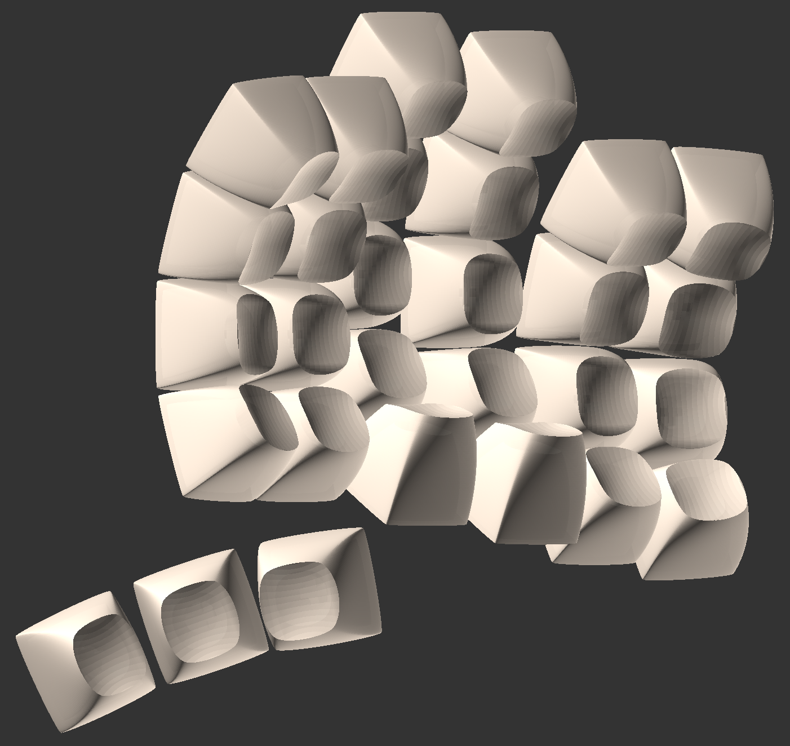

# Pseudo Make Me Key Cap Profile

## How to
* make sure OpenSCAD is up to date.
* unzip libraries.zip into your OpenSCAD libraries
* ("MT4" profile are the only un-commented keys 0-5 in MX_DES_Standard.scad)
* select keycap you want to render by changing KeyID value
* change KeyID to corresponding Parameter ID
* press F5 to review
* press F6 to render
* press F7 to export as STL

## Distorted Ellipsoidal Saddle (DES)
High sculpt smooth transition profile

## Distorted Ellipsoidal Saddle (DES) "MT4"
A taller and rearranged version of DES for keywell ergo boards. Similar to MT3 and SA profiles.
* R3 normal for non-home keys ***CAPS*** ***SHIFT*** ***G*** ***H*** ***'*** ***SHIFT***
* R1 number row (much taller version of DES R5 mod rotated 180)
* R2 top alpha row (taller version of DES R5 mod rotated 180)
* R3 deepdish home row for ***ASDF JKL;*** keys (taller DES R3 DD)
* R4 bottom row (taller version of DES R2)
* R5 bottom two row (dacman) & thumbs (DES R1 rotated 180)

